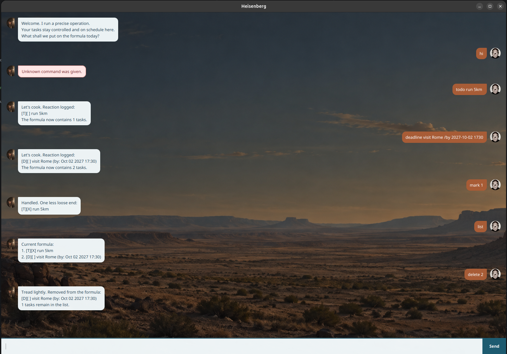

# Heisenberg User Guide

**Heisenberg** is a compact desktop chatbot for keeping tasks under control. Add a task, find it later, and let Heisenberg save the list automatically.

## Getting started

1. Install Java 25.
2. From the project folder, run `./gradlew run`.
3. Enter a command in the text box and press <kbd>Enter</kbd> or click **Send**.

Commands are case-insensitive. Task numbers are the numbers shown by `list`.

## Commands

| Command | Example | What it does |
| --- | --- | --- |
| Add a to-do | `todo buy groceries` | Adds a task without a date. |
| Add a deadline | `deadline submit report /by 2026-09-20 2359` | Adds a task due at a specific date and time. |
| Add an event | `event project meeting /from 2026-09-20 1400 /to 2026-09-20 1600` | Adds an event with a start and end time. |
| List tasks | `list` | Shows every task and its completion status. |
| Mark complete | `mark 2` | Marks task 2 as done. |
| Delete a task | `delete 2` | Removes task 2. |
| Find tasks | `find report` | Shows tasks whose descriptions contain `report`. Searches are case-sensitive. |
| Sort deadlines | `sort` | Places deadlines first, ordered from earliest to latest. |
| Exit | `bye` | Closes Heisenberg after displaying a goodbye message. |

> **Date and time format:** use `yyyy-MM-dd HHmm` in 24-hour time. For example, `2026-09-20 0830` means 20 September 2026 at 8:30 am. An event must end after it starts.

## Your task data

Heisenberg saves changes automatically in `data/storage.txt` and restores the list when it starts. Keep this file if you want to retain your tasks; avoid editing it manually.

## Need help?

If a command is incomplete or invalid, Heisenberg shows an error message in red. Check the command table, especially the date format and required `/by`, `/from`, and `/to` markers, then try again.
